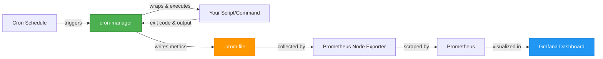
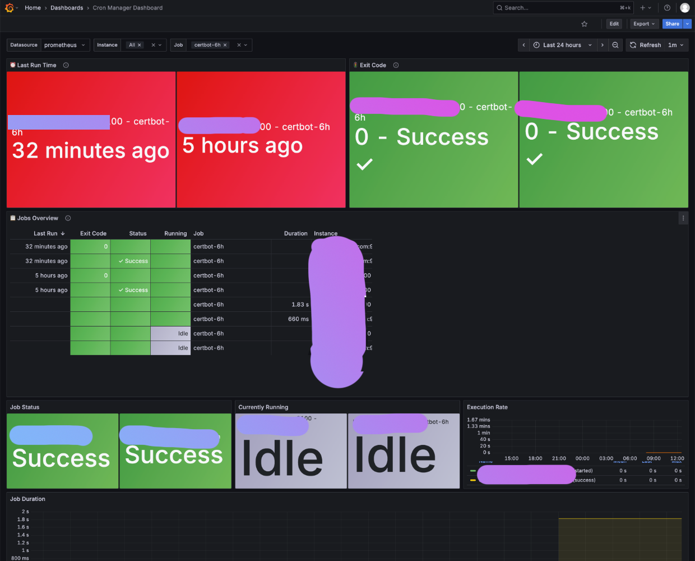

# cron-manager

English | [简体中文](README_CN.md)

**A lightweight cron job wrapper that turns your scheduled tasks into observable, monitorable workloads with zero configuration.**

[](LICENSE)
[](https://goreportcard.com/report/github.com/alswl/cron-manager)

## 🎯 What is cron-manager?

cron-manager wraps your cron jobs and automatically exports detailed execution metrics to Prometheus, giving you instant visibility into your scheduled tasks without modifying any existing scripts.

### How It Works



### 🌟 Key Features

- **📊 Zero-Config Monitoring** - Just wrap your command, metrics export automatically
- **⏱️ Precise Timing** - Sub-second execution duration tracking
- **🚦 Smart Status** - Captures exit codes, detects failures, tracks running state
- **📈 Rich Metrics** - Success rate, execution frequency, duration trends, and more
- **🔒 Production-Ready** - File locking, atomic writes, proper error handling
- **🎨 Beautiful Dashboard** - Pre-built Grafana dashboard highlighting critical info
- **🔧 Flexible** - Custom metric names, paths, configurable behavior

## 🚀 Quick Start

### Installation

**Download from releases:**
```bash
# Linux amd64
wget https://github.com/alswl/cron-manager/releases/latest/download/cronmanager-linux-amd64
chmod +x cronmanager-linux-amd64
sudo mv cronmanager-linux-amd64 /usr/local/bin/cronmanager

# macOS arm64
wget https://github.com/alswl/cron-manager/releases/latest/download/cronmanager-darwin-arm64
chmod +x cronmanager-darwin-arm64
sudo mv cronmanager-darwin-arm64 /usr/local/bin/cronmanager
```

**Or build from source:**
```bash
make build
sudo mv ./bin/cronmanager /usr/local/bin/
```

### Basic Example

```bash
# Before: Plain cron job
0 2 * * * /usr/bin/backup.sh

# After: Observable cron job with monitoring
0 2 * * * cronmanager -n "daily_backup" -- /usr/bin/backup.sh
```

That's it! Now you get:
- ⏰ Last run timestamp
- 🚦 Exit code (0 = success, non-zero = failure)
- ⏱️ Execution duration
- 📊 Success rate over time
- 🔄 Execution frequency
- 🏃 Currently running status

## 📖 Usage

### Command Syntax

```bash
cronmanager -n <job_name> [options] -- <command> [args...]
```

### Common Examples

```bash
# With logging
cronmanager -n "backup" -l /var/log/backup.log -- /usr/bin/backup.sh

# Custom metrics path
cronmanager -n "sync" -d /tmp/prometheus -- /usr/bin/sync.sh

# Idle wait mode (for long-running detection)
cronmanager -n "etl" -i 60 -- /usr/bin/etl.py

# Disable metrics (dry-run mode)
cronmanager -n "test" --no-metric -- /usr/bin/test.sh
```

### CLI Options

| Option | Description | Default |
|--------|-------------|---------|
| `-n, --name` | Job name (required) | - |
| `-l, --log` | Log file path | discard output |
| `-i, --idle` | Minimum run duration (seconds) | 0 |
| `-d, --dir` | Metrics directory | `/var/lib/prometheus/node-exporter` |
| `--textfile` | Metrics filename | `crons.prom` |
| `--metric` | Metric name prefix | `crontab` |
| `--no-metric` | Disable metrics | false |
| `-v, --version` | Show version | - |

**Note:** Command and arguments must be placed after `--` separator.

## 📊 Metrics

cron-manager exports the following Prometheus metrics (prefix: `crontab` by default):

| Metric | Type | Description |
|--------|------|-------------|
| `{prefix}_last_run_timestamp_seconds` | gauge | Unix timestamp of last execution |
| `{prefix}_exit_code` | gauge | Last exit code (0 = success) |
| `{prefix}_failed` | gauge | Failure status (0 or 1) |
| `{prefix}_duration_seconds` | gauge | Execution duration |
| `{prefix}_running` | gauge | Currently running (0 or 1) |
| `{prefix}_runs_total{status="..."}` | counter | Total runs by status |

### Example Output

```prometheus
# HELP crontab_last_run_timestamp_seconds Timestamp of the last job execution
# TYPE crontab_last_run_timestamp_seconds gauge
crontab_last_run_timestamp_seconds{name="daily_backup"} 1704067200

# HELP crontab_exit_code Exit code of the last job execution
# TYPE crontab_exit_code gauge
crontab_exit_code{name="daily_backup"} 0

# HELP crontab_duration_seconds Duration of the last job execution in seconds
# TYPE crontab_duration_seconds gauge
crontab_duration_seconds{name="daily_backup"} 125.45
```

### Useful Queries

```promql
# Currently running jobs
crontab_running == 1

# Jobs that failed in last run
crontab_failed == 1

# Success rate (5m window)
rate(crontab_runs_total{status="success"}[5m]) / rate(crontab_runs_total[5m])

# Jobs not run in last 24h
time() - crontab_last_run_timestamp_seconds > 86400
```

## 📈 Grafana Dashboard



A pre-configured dashboard is available in [`grafana-dashboard.json`](grafana-dashboard.json).

**Key Panels:**
- ⏰ **Last Run Time** - When each job last executed (with aging alerts)
- 🚦 **Exit Code** - Color-coded success/failure status
- 📋 **Jobs Overview** - Sortable table with all job details
- 📊 **Success Rate** - Historical success metrics
- ⏱️ **Duration Trends** - Execution time over time

**Import:** Dashboards → Import → Upload `grafana-dashboard.json`

## ⚙️ Configuration

### Prometheus Node Exporter Setup

```bash
# Enable TextFile Collector
node_exporter \
  --collector.textfile \
  --collector.textfile.directory=/var/lib/prometheus/node-exporter
```

### Custom Metrics Path

**Priority order:**
1. CLI flag `--dir` (highest)
2. Environment variable `COLLECTOR_TEXTFILE_PATH`
3. Default: `/var/lib/prometheus/node-exporter`

**Example:**
```bash
# Via environment variable
export COLLECTOR_TEXTFILE_PATH=/custom/metrics
cronmanager -n "job" -- /usr/bin/command

# Via CLI flag (overrides env var)
cronmanager -n "job" --dir /tmp/metrics --textfile custom.prom -- /usr/bin/command
```

**Permissions:** Ensure write access to the metrics directory for the cron user.

## 📝 License

This project is licensed under the [GNU General Public License v3.0](LICENSE).

## 🙏 Acknowledgments

Based on the original work by [abohmeed/cronmanager](https://github.com/abohmeed/cronmanager). Thanks to the original author and contributors.
