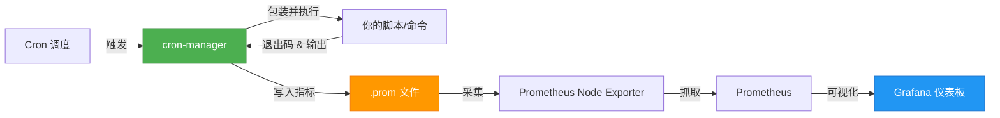

# cron-manager

[English](README.md) | 简体中文

**一款轻量级的 cron 任务包装器，零配置即可将计划任务转换为可观测、可监控的工作负载。**

[](LICENSE)
[](https://goreportcard.com/report/github.com/alswl/cron-manager)

## 🎯 什么是 cron-manager？

cron-manager 包装你的 cron 任务，自动导出详细的执行指标到 Prometheus，让你无需修改任何现有脚本，即可获得计划任务的实时可见性。

### 工作原理



### 🌟 核心特性

- **📊 零配置监控** - 仅需包装命令，指标自动导出
- **⏱️ 精确计时** - 亚秒级执行时长跟踪
- **🚦 智能状态** - 捕获退出码、检测失败、追踪运行状态
- **📈 丰富指标** - 成功率、执行频率、耗时趋势等
- **🔒 生产就绪** - 文件锁、原子写入、完善的错误处理
- **🎨 精美仪表板** - 预配置的 Grafana 仪表板，突出关键信息
- **🔧 灵活配置** - 自定义指标名称、路径、可配置行为

## 🚀 快速开始

### 安装

**从 Releases 下载：**
```bash
# Linux amd64
wget https://github.com/alswl/cron-manager/releases/latest/download/cronmanager-linux-amd64
chmod +x cronmanager-linux-amd64
sudo mv cronmanager-linux-amd64 /usr/local/bin/cronmanager

# macOS arm64
wget https://github.com/alswl/cron-manager/releases/latest/download/cronmanager-darwin-arm64
chmod +x cronmanager-darwin-arm64
sudo mv cronmanager-darwin-arm64 /usr/local/bin/cronmanager
```

**或从源码编译：**
```bash
make build
sudo mv ./bin/cronmanager /usr/local/bin/
```

### 基础示例

```bash
# 之前：普通 cron 任务
0 2 * * * /usr/bin/backup.sh

# 之后：可观测的 cron 任务（带监控）
0 2 * * * cronmanager -n "daily_backup" -- /usr/bin/backup.sh
```

就这么简单！现在你可以获得：
- ⏰ 最后运行时间戳
- 🚦 退出码（0 = 成功，非零 = 失败）
- ⏱️ 执行时长
- 📊 一段时间内的成功率
- 🔄 执行频率
- 🏃 当前运行状态

## 📖 使用方法

### 命令语法

```bash
cronmanager -n <job_name> [选项] -- <命令> [参数...]
```

### 常用示例

```bash
# 带日志记录
cronmanager -n "backup" -l /var/log/backup.log -- /usr/bin/backup.sh

# 自定义指标路径
cronmanager -n "sync" -d /tmp/prometheus -- /usr/bin/sync.sh

# 空闲等待模式（用于长时间运行检测）
cronmanager -n "etl" -i 60 -- /usr/bin/etl.py

# 禁用指标（试运行模式）
cronmanager -n "test" --no-metric -- /usr/bin/test.sh
```

### 命令行选项

| 选项 | 说明 | 默认值 |
|------|------|--------|
| `-n, --name` | 任务名称（必需） | - |
| `-l, --log` | 日志文件路径 | 丢弃输出 |
| `-i, --idle` | 最小运行时长（秒） | 0 |
| `-d, --dir` | 指标目录 | `/var/lib/prometheus/node-exporter` |
| `--textfile` | 指标文件名 | `crons.prom` |
| `--metric` | 指标名称前缀 | `crontab` |
| `--no-metric` | 禁用指标 | false |
| `-v, --version` | 显示版本 | - |

**注意：** 命令和参数必须放在 `--` 分隔符之后。

## 📊 指标

cron-manager 导出以下 Prometheus 指标（默认前缀：`crontab`）：

| 指标 | 类型 | 说明 |
|------|------|------|
| `{prefix}_last_run_timestamp_seconds` | gauge | 最后执行的 Unix 时间戳 |
| `{prefix}_exit_code` | gauge | 最后退出码（0 = 成功） |
| `{prefix}_failed` | gauge | 失败状态（0 或 1） |
| `{prefix}_duration_seconds` | gauge | 执行时长 |
| `{prefix}_running` | gauge | 当前运行中（0 或 1） |
| `{prefix}_runs_total{status="..."}` | counter | 按状态分类的总运行次数 |

### 输出示例

```prometheus
# HELP crontab_last_run_timestamp_seconds Timestamp of the last job execution
# TYPE crontab_last_run_timestamp_seconds gauge
crontab_last_run_timestamp_seconds{name="daily_backup"} 1704067200

# HELP crontab_exit_code Exit code of the last job execution
# TYPE crontab_exit_code gauge
crontab_exit_code{name="daily_backup"} 0

# HELP crontab_duration_seconds Duration of the last job execution in seconds
# TYPE crontab_duration_seconds gauge
crontab_duration_seconds{name="daily_backup"} 125.45
```

### 实用查询

```promql
# 当前运行中的任务
crontab_running == 1

# 上次运行失败的任务
crontab_failed == 1

# 成功率（5分钟窗口）
rate(crontab_runs_total{status="success"}[5m]) / rate(crontab_runs_total[5m])

# 最近 24 小时未运行的任务
time() - crontab_last_run_timestamp_seconds > 86400
```

## 📈 Grafana 仪表板


预配置的仪表板可在 [`grafana-dashboard.json`](grafana-dashboard.json) 中找到。

**关键面板：**
- ⏰ **最后运行时间** - 每个任务的最后执行时间（带老化告警）
- 🚦 **退出码** - 带颜色编码的成功/失败状态
- 📋 **任务概览** - 可排序的任务详情表格
- 📊 **成功率** - 历史成功指标
- ⏱️ **耗时趋势** - 随时间变化的执行时间

**导入：** 仪表板 → 导入 → 上传 `grafana-dashboard.json`

## ⚙️ 配置

### Prometheus Node Exporter 设置

```bash
# 启用 TextFile Collector
node_exporter \
  --collector.textfile \
  --collector.textfile.directory=/var/lib/prometheus/node-exporter
```

### 自定义指标路径

**优先级顺序：**
1. CLI 参数 `--dir`（最高）
2. 环境变量 `COLLECTOR_TEXTFILE_PATH`
3. 默认：`/var/lib/prometheus/node-exporter`

**示例：**
```bash
# 通过环境变量
export COLLECTOR_TEXTFILE_PATH=/custom/metrics
cronmanager -n "job" -- /usr/bin/command

# 通过 CLI 参数（覆盖环境变量）
cronmanager -n "job" --dir /tmp/metrics --textfile custom.prom -- /usr/bin/command
```

**权限：** 确保 cron 用户对指标目录有写入权限。

## 📝 许可证

本项目采用 [GNU 通用公共许可证 v3.0](LICENSE) 授权。

## 🙏 致谢

本项目基于 [abohmeed/cronmanager](https://github.com/abohmeed/cronmanager) 的原始工作。感谢原作者和贡献者。
